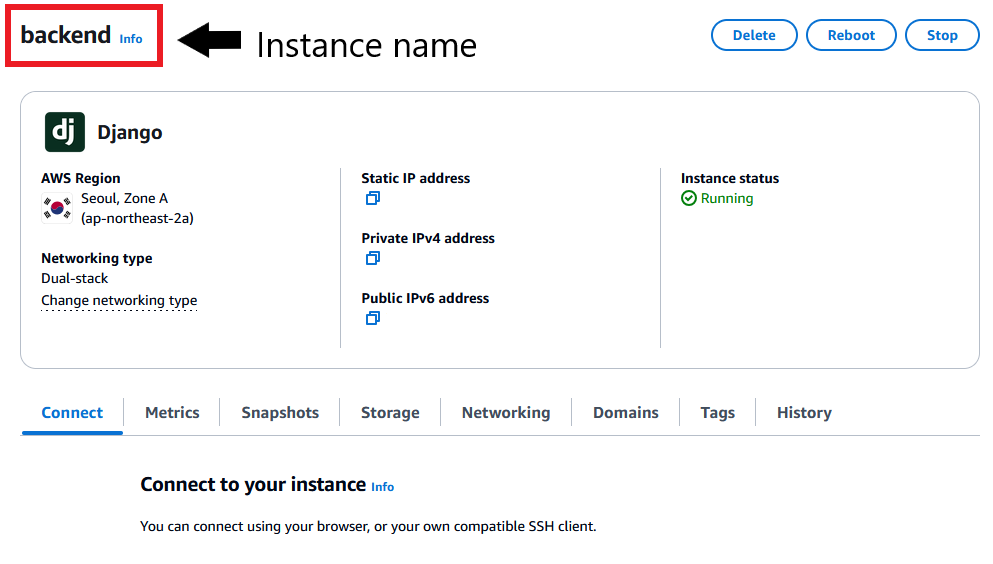
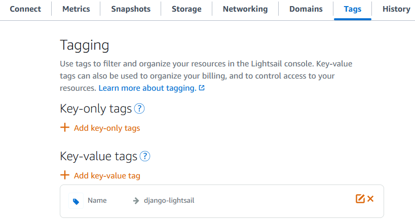
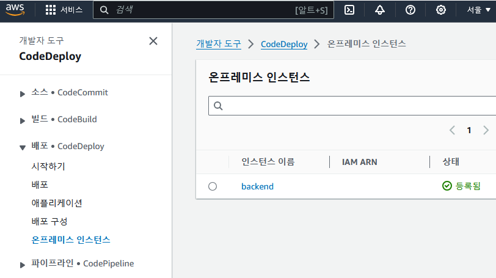
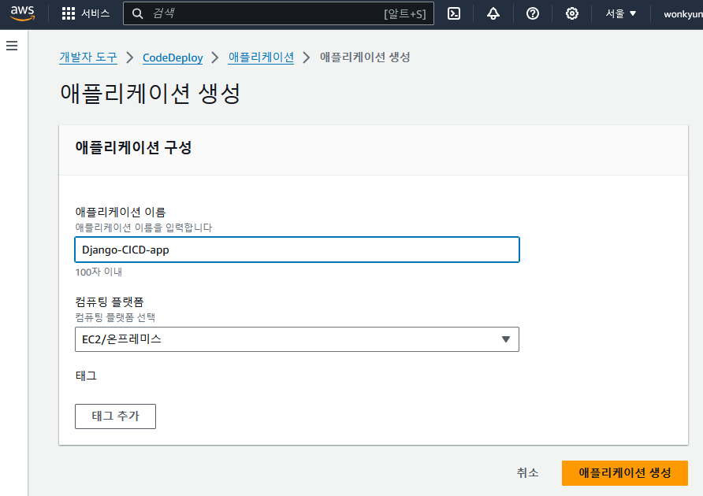
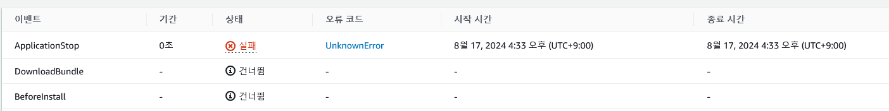
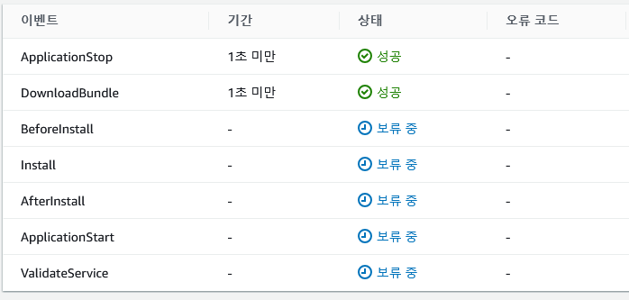

# 4. AWS CodeDeploy와 Github Actions를 이용한 CICD 환경 구축 (AWS LightSail)
### 목적
로컬에서 작업 후 main branch에 변경사항을 PR, Push하면 aws lightsail에 구축된 인스턴스에 해당 작업이 동기화되도록 하고자 함.

## 1. LightSail 환경 구성하기(인스턴스 밖에서 설정할것들)

1. 인스턴스 생성
    
    
    
    **생성된 인스턴스에 인스턴스 이름을 잘 기억해둡시다! (Django가 인스턴스 이름인줄 알고 삽질했던..ㅠㅠ)**
    
2. 인스턴스에 tag달아주기

    : 이 태그를 이용해서 온프레미스 인스턴스를 연결하게 됩니다. 필수!

    

## 2. AWS IAM 생성하기

### IAM User 생성

AWS CodeDeploy에 온프레미스 인스턴스를 생성해주기 위한 IAM 사용자를 만들어야한다. 

해당 User에는 `codedeploy:RegisterOnPremisesInstance`권한이 필요하다. 또한 S3에 접근하는 경우가 발생하기도 하기에 S3 접근 정책을 넣어주어도 좋다.

### IAM Role 생성

CodeDeploy가 동작하기 위해 해당 서비스에 권한 부여가 필요하다. 따라서 Role을 이용해서 CodeDeploy가 사용할 권한이 붙어있는 역할을 생성해준다.

Deploy 수행 시 S3를 거치기 때문에 S3 권한을 넣어주었다.

## 3. LightSail 환경 구성하기(온프레미스 인스턴스 등록)

글에 앞서 왜 ec2처럼 바로 연결하지않고 온프레미스 인스턴스로 등록해야하는지 궁금하여 검색과 GPT를 이용해 답을 알아냈다.

**Lightsail 인스턴스는 AWS CodeDeploy의 기본적인 관리 도메인에 포함되지 않기 때문에 온프레미스 인스턴스로 등록해야한다.
온프레미스 인스턴스로 등록함으로써, Lightsail 인스턴스도 CodeDeploy의 기능을 활용하여 배포 작업을 자동화할 수 있다.**

따라서 위에 생성한 IAM을 이용해 온프레미스 인스턴스를 등록해주어야한다.

### CodeDeploy 에이전트 설치

lightsail에 CodeDeploy를 사용하기 위해서 에이전트를 설치해준다. ssh를 이용해서 접속한 후 다음 명령을 수행했다.

```bash
sudo apt-get update
sudo apt-get install -y ruby wget
cd /home/ubuntu
wget https://bucket-name.s3.region-identifier.amazonaws.com/latest/install
chmod +x ./install
sudo ./install auto
```

### 온프레미스 인스턴스 등록 및 태그 추가

다음 명령을 이용해서 인스턴스를 등록한다. 

```bash
aws deploy register-on-premises-instance --instance-name 이름 --iam-user-arn arn:aws:iam::계정ID:user/CodeDeployUser --region 리전
```

위의 정보들을 바탕으로 intance-name과 iam-user-arn을 등록해준다.  
추가로 region이 필요한데 서울의 경우 `ap-northeast-2` 로 진행하면된다.

다음은 배포그룹에서 사용하기 위해 태그를 추가한다.

```bash
aws deploy add-tags-to-on-premises-instances --instance-names 이름 --tags Key=Name,Value=MyOnPremisesInstance
```

value값을 원하는 값으로 지정하면 된다.

### **CodeDeploy 에이전트 시작**

```bash
sudo systemctl start codedeploy-agent
# 또는 
sudo service codedeploy-agent start

# 동작 확인
sudo service codedeploy-agent status
```

정상적으로 Active되면 완료

이제 AWS console에서 확인하면 정상적으로 등록되어있다.



## 4. CodeDeploy 애플리케이션 및 배포그룹 설정

1. 애플리케이션 생성을 해준다.
    
    
    
2. 배포그룹 생성하기
    1. 배포 그룹 이름 설정하기
    2. 서비스 역할 입력 → 앞에서 생성해둔 role을 붙이면 된다!
    3. 환경 구성 > 온프레미스 인스턴스
        1. 키와 값을 작성해줍니다.
    4. 나머지 구성은 입맛에 맞추어 구성해준뒤 배포그룹을 생성합니다.

## 5. Github Actions 구성하기

Github Actions를 이용해서 파일을 S3에 저장하고 CodeDeploy를 호출 시키는 과정을 자동화합니다.

- Action이 수행될 조건을 정의합니다. main branch에 push 또는 PR되는 경우만 작동되게 하기위해 다음과 같이 정의했습니다.
    
    ```yaml
    on:
      push:
        branches:
          - main
      pull_request:
        branches:
          - main
    ```
    
- Job을 만들어 동작을 정의합니다. 주석을 이용해서 설명하겠습니다.
    
    ```yaml
    jobs:
      deploy:
      # ubuntu 환경에서 수행되게 만들기
        runs-on: ubuntu-latest
    
        steps:
        - name: Checkout code
          uses: actions/checkout@v2
        # 파일 생성하기 .tgz 파일로 전체 코드들을 압축합니다.
        - name: Make Tar File
          run: |
            tar -cpvzf ./deploy-package.tgz *
          shell: bash
      # AWS Credentials를 정의합니다. 이를 위해 Github secrets를 사용합니다.
        - name: Configure AWS Credentials
          uses: aws-actions/configure-aws-credentials@v1
          with:
            aws-access-key-id: ${{ secrets.AWS_ACCESS_KEY_ID }}
            aws-secret-access-key: ${{ secrets.AWS_SECRET_ACCESS_KEY }}
            aws-region: us-west-2
      # S3에 업로드
        - name: Upload to S3
          run: |
            aws s3 cp \
              --region us-west-2 \
              ./deploy-package.tgz s3://awsbucket.palebluedot.django/build/deploy-package.tgz
      # Code Deploy를 호출합니다.
        - name: Code Deploy
          run: |
            aws deploy create-deployment \
                --application-name 애플리케이션 이름 \
                --file-exists-behavior OVERWRITE \
                --deployment-config-name CodeDeployDefault.OneAtATime \
                --deployment-group-name 디플로이 그룹이름 \
                --s3-location bucket= s3버킷경로,bundleType=tgz,key=파일 위치
    ```
    
- 전체코드
    
    ```yaml
    name: Deploy Django to EC2
    
    on:
      push:
        branches:
          - main
      pull_request:
        branches:
          - main
    
    jobs:
      deploy:
        runs-on: ubuntu-latest
    
        steps:
        - name: Checkout code
          uses: actions/checkout@v2
    
        - name: Make Tar File
          run: |
            tar -cpvzf ./deploy-package.tgz *
          shell: bash
        
        - name: Configure AWS Credentials
          uses: aws-actions/configure-aws-credentials@v1
          with:
            aws-access-key-id: ${{ secrets.AWS_ACCESS_KEY_ID }}
            aws-secret-access-key: ${{ secrets.AWS_SECRET_ACCESS_KEY }}
            aws-region: us-west-2
        
        - name: Upload to S3
          run: |
            aws s3 cp \
              --region us-west-2 \
              ./deploy-package.tgz s3://awsbucket.palebluedot.django/build/deploy-package.tgz
        
        - name: Code Deploy
          run: |
            aws deploy create-deployment \
                --application-name 애플리케이션 이름 \
                --file-exists-behavior OVERWRITE \
                --deployment-config-name CodeDeployDefault.OneAtATime \
                --deployment-group-name 디플로이 그룹이름 \
                --s3-location bucket= s3버킷경로,bundleType=tgz,key=파일 위치
    ```
    

### appspec.yml 파일 만들기

배포되는 파일의 루트위치에 appspec.yml을 만들어두면 배포 후에 동작을 설정해줄 수 있습니다.

아래와 같이 기본적인 파일 경로만 저장하는 경우도 있으나, hooks를 이용해서 install 이전, 이후에 동작할 것들을 정의할 수 있습니다. (BeforeInstall, AfterInstall)

```yaml
version: 0.0
os: linux
files:
  - source: /
    destination: /home/ec2-user # 배포할 디렉터리 경로
# hooks:
#   AfterInstall:
#     - location: scripts/after_install.sh
#       timeout: 300
#       runas: root
```

---

## Trouble shooting

### Lightsail 인스턴스에 연결 실패

CodeDeploy에서 lightsail 인스턴스에 연결이 안되는 에러가 발생했습니다. 



이런식으로 에러코드없이 단순하게 실패가 되어서 무슨일일까 로그도 확인했으나…

로그 확인하기: `tail /var/log/aws/codedeploy-agent/codedeploy-agent.log`

아무 이상없이 인스턴스에 있는 에이전트는 연결을 기다리고만 있었습니다.. 

찾아낸 해결방법은 아래와 같습니다.

CodeDeploy에서 온프레미스 인스턴스 생성 시에 파일이 하나 생성되어야합니다.

`/etc/codedeploy-agent/conf/codedeploy.onpremises.yml` 해당 파일에는 아래와 같은 정보가 담깁니다.

```yaml
aws_access_key_id: YOUR_ACCESS_KEY_ID
aws_secret_access_key: YOUR_SECRET_ACCESS_KEY
iam_user_arn: arn:aws:iam::your_account_id:user/your_iam_user
region: YOUR_REGION
```

그러나.. 저는 이 파일이 존재하지 않았습니다. 따라서 코드 디플로이와 에이전트 사이에 연결이 적절하지 못했던것같습니다. 그리하여 다음 명령을 통해 파일을 생성했습니다.

`sudo mkdir -p /etc/codedeploy-agent/conf/`
`sudo nano /etc/codedeploy-agent/conf/codedeploy.onpremises.yml` → 파일에는 위의 내용이 들어가면 됩니다.

`sudo chmod 600 /etc/codedeploy-agent/conf/codedeploy.onpremises.yml`

그렇게 광명을 찾게 되었습니다.. beforeInstall 이 보류중인 이유는 제가 lightsail의 인스턴스 이름을 실수로 잘못 설정해서 그렇습니다..


