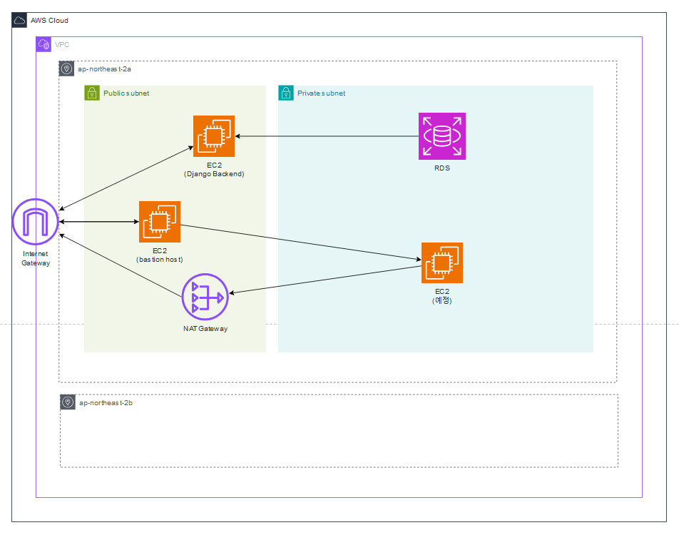
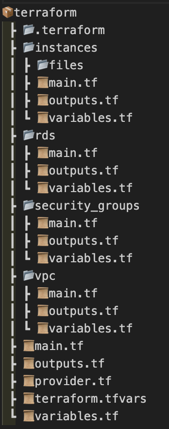

---
layout:
  title:
    visible: true
  description:
    visible: false
  tableOfContents:
    visible: true
  outline:
    visible: true
  pagination:
    visible: true
---

# 2. 기본 VPC 구축
## 1) 이전에 구축한 방법
이전엔 AWS 사이트에서 콘솔을 통해 손수 구축했습니다. 그러나, 옵션을 변경해야 하는데 이를 지원하지 않아 기존 것을 삭제하고 처음부터 새로 구축해야 하는 일이 잦다는 문제가 있었습니다. 이러한 이유로, Terraform과 Ansible을 사용해 IaC를 기반으로 한 인프라 구축을 시도해 편의성을 비롯한 여러 장단점을 비교하는 경험을 해보았습니다.

## 2) Terraform을 활용한 VPC 구축
초기 구축 환경에서 각각의 서비스들을 생성하고 연결하는 작업은 꽤나 번거롭습니다. 특히나 서비스간에 연결이 원활하지 않을때 겪어야하는 시행착오들은 프로젝트 수행 시간에 있어 많은 파이를 차지합니다.
이에 테라폼을 활용하여 사전에 발생가능한 문제들을 확인하고 실제 환경에 문제가 발생하지 않도록 인프라를 구성하여 시간, 금전적 리소스를 최소화해 진행하였습니다.

### Terraform module의 활용
module이란? : Terraform 모듈은 인프라를 코드로 정의할 때 재사용 가능하고 관리하기 쉬운 구성을 만들기 위해 사용하는 구조입니다.

#### 장점
1.	재사용성: 모듈을 여러 곳에서 재사용할 수 있습니다.
2.	조직화: 인프라 구성을 논리적인 단위로 분리하여 코드가 더 깔끔하고 관리하기 쉬워집니다.
3.	유지보수 용이성: 변경 사항을 모듈 단위로 관리할 수 있어 유지보수가 더 간편합니다.
4.	일관성: 모듈을 사용하면 여러 환경에서 일관된 인프라 구성을 유지할 수 있습니다.

이와 같은 장점으로 인프라 구성을 논리적으로 단위로 분리하여 모듈화했습니다.

```bash
# main.tf
module "vpc" {
  source                = "./vpc"
  availability_zoneA    = var.availability_zoneA
  ...
}
module "security_groups" {
  source = "./security_groups"
  vpc_id = module.vpc.vpc_id
  ...
}
...
```

### 변수 관리
관리해야하는 변수의 종류는 두가지입니다.
1. 보안이 필요한 변수 ex) pw
2. 생성된 모듈의 정보를 바탕으로 생성되며, 다른 모듈에서 필요한 변수

#### 보안이 필요한 변수: terraform.tfvars
보안이 필요한 변수들은 tfvars파일을 이용하여 실제 값들을 부여합니다. <br>
이를 통해서 region, cidr과 같은 사용자가 직접 부여하는 변수들을 별도로 관리합니다.
```bash
# terraform.tfvars
region             = ""
...

# CIDR
public_cidr           = "0.0.0.0/0"
vpc_cidr              = ""
...
```

#### 생성 변수: variable.tf
변수의 생성은 다음과 같은 절차로 이루어집니다.
1. 모듈 생성 (VPC,Instance...)
2. outputs.tf를 통한 변수값 추출
3. 모듈에 변수 부여
4. 사용

이해를 돕기위해 vpc의 생성과 vpc_id 변수를 생성해 사용하는 예시를 작성합니다.

1. VPC 생성
```bash
# main.tf
module "vpc" {
  source                = "./vpc"
  availability_zoneA    = var.availability_zoneA
```
```bash
# ./vpc/main.tf
resource "aws_vpc" "main" {
  cidr_block = var.vpc_cidr

  tags = {
    Name = "vpc_name"
  }
}
...
```
2. output.tf로 변수 추출
```bash
# ./vpc/output.tf
output "vpc_id" {
  value = aws_vpc.main.id
}
...
```
3. 모듈에 var 부여
```bash
# main.tf
module "security_groups" {
  vpc_id = module.vpc.vpc_id
  ...
```
4. 변수 선언 (사용하고자 하는 모듈)
```bash
# ./security_groups/variables.tf
variable "vpc_id" {
  description = "The VPC ID where the security groups will be created"
  type        = string
}
...
```

### VPC, Subnet 구성하기
테라폼을 이용하여 VPC를 생성했습니다. 1번의 기존 Infra 아키텍처에 맞추어 하나의 VPC안에 2개의 가용영역을 구축, Public,Private 서브넷을 구성했습니다.




#### 전체적인 디렉토리의 구조는 아래와 같습니다. <br>


## 3) 보안 및 Terraform 전용 EC2 인스턴스 구축
infra 구축 시 협업을 용이하게 진행하고자 인프라 전용 EC2인스턴스를 구성해 사용하고 있습니다.

AWS Credentials, RDS DB_password와 같은 민감한 변수들의 관리를 위해 AWS Secrets Manager를 사용해 관리합니다. 과정은 아래와 같습니다.

Secrets Manager에 암호를 저장 > 시크릿을 가져와 파싱 > 환경변수로 설정

Secrets에서 값을 가져오는 코드입니다.

```bash
# /set_aws_env_from_secrets.sh
# AWS Secrets Manager에서 시크릿을 가져옵니다
SECRET=$(aws secretsmanager get-secret-value --secret-id $SECRET_NAME --region $REGION | jq -r .SecretString)
```

이렇게 값을 가져와 환경변수로 설정 후 terraform.tfvars에 값을 집어넣어 변수를 설정해줍니다.
```bash
# /generate_tfvars.sh
#!/bin/bash

# terraform.tfvars 파일에 환경 변수 추가
cat <<EOF >> ./BackEnd/terraform/terraform.tfvars

# 추가된 환경 변수
db_username = "$username"
db_password = "$password"
EOF
```
**정리**<br>
테라폼 코드를 github에서 가져오고 환경변수를 세팅하여 전체 VPC를 구축하는데 사용하고 있습니다.
