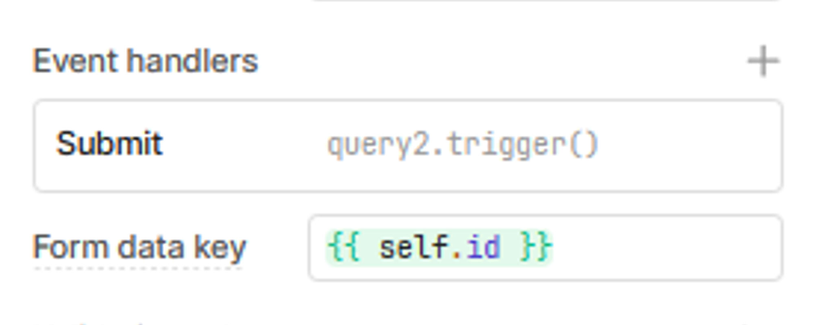
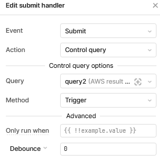

# 🚜 Client

Retool을 이용한 FE개발 페이지입니다.

각 페이지 구성과 연결, 세부 동작방식을 정리하고자 만들게 되었습니다.

[Retool | The fastest way to build internal software.](https://retool.com/)

# App(페이지)구성 & UML

## UML


### 동작 과정 설명

1. rearch_form (Retool App)
    1. research_form페이지에서 사용자가 레시피를 검색하면 Backend서버에 Get 방식으로 API call
2. Backend (Server)
    1. 전달받은 검색어를 ES를 이용해 DB에 레시피가 있는지 검색한다.
    2. 검색 결과를 Json의 형태로 return한다.
3. rearch_form (Retool App)
    1. 레시피 여부 파악
        1. 레시피가 존재하면 jaringobi search result App으로 페이지 전환
        2. 레시피가 존재하지 않으면 research form App으로 페이지 출력
    2. API response는 local storage에 저장한다.
4. jaringobi search result (Retool App)
    1. 저장된 local storage의 json data를 기반으로 페이지 출력

## 페이지 구성

### research form (Main page)

: 검색이 시작되는 메인 페이지 검색창이 존재한다. 사용자가 처음 맞이하는 랜딩페이지




text input Event handlers



submit handler

- 조건: Submit (사용자가 검색창에서 텍스트 입력 후 엔터)
- 발생: query2 호출

### jaringobi search result

: 검색 결과 페이지. 페이지 내 데이터는 localstorage의 데이터 사용


1. Youtube
    - 사용자가 검색한 메뉴를 기반으로 최저가 요리 영상을 보여주는 부분
2. 레시피 정보
    - 레시피의 간단한 개요를 보여준다.
    - 레시피 이름, 최저가, 재료정보, Youtube URL을 나열
3. 재료 리스트
    - 메뉴에 포함된 재료를 재료명과 사진을 가져와 리스트 형태로 나열
    - 좌우 슬라이드 방식
    - 클릭 시 해당 제품의 쿠팡url로 접속된다.

# Code & Query 명세, API 예시

## research form

### query2

- 목적: 사용자의 입력을 AWS위의 Backend 서버에 전달 및 API 요청
- 결과: API 요청 및 확인
    - API 정상 반환 시 동작
        - localStortage clear
        - openApp - jaringobi search result
        - localStorage setValue
            - json Data localStorage에 저장
    - API 비정상 반환 혹은 실패 시 동작
        - openApp → research_form - failed (App) 페이지 전환
        - 사용자 재검색 유도

## jaringobi search result

### menu_response

: localStorage에 저장된 값 할당 → `menu_response.value`로 접근

- Code
    
    ```jsx
    const menu = {{  localStorage.values.menu }}
    const menu_result = JSON.parse(menu)
    
    return menu_result 
    ```
    
- Sample Code(메뉴 이름 조회)
    
    ```jsx
    {{ menu_response.value.results[0].menu }}
    ```
    

### menu_result

: menu_response 재가공, 재료들의 이름을 가져와 하나의 문자열로 재생성

- Code
    
    ```jsx
    const firstItem = {{  menu_response.value.results[0].recipe }}
    const ingredients = firstItem.ingredients.map(ingredient => ingredient.name).join(', ');
    
    return ingredients
    
    // output sample
    // :"순살 닭 정육(닭다리살), 탈지분유"
    ```
    
- Sample Code(메뉴 리스트 조회)
    
    ```jsx
    {{ menu_list.value }}
    ```
    

# 참고

### API 명세

[API 명세 | PaleBlueDot](https://palebluedot.gitbook.io/palebluedot-1/common/api)