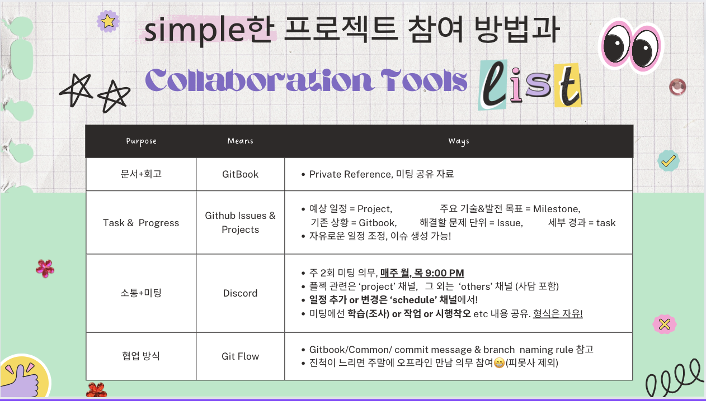

---
layout:
  title:
    visible: true
  description:
    visible: false
  tableOfContents:
    visible: true
  outline:
    visible: true
  pagination:
    visible: true
---

# ⚽ 협업 방법
<figure><figcaption>

</figcaption></figure>
  

# 🔥 Code of Conduct
### 1. 기술을 새롭게 적용할 때, 팀원이 납득할 수 있는 타당한 이유를 제시한다.
### 2. 의견이 있으면 부담없이 제시한다.
### 3. 지각하지 않는다.
### 4. 정해진 컨벤션을 지킨다.
### 5. 문서화를 습관화한다.
### 6. 문제가 있으면 Discord에 모여 문제에 대해 얘기한다.
### 7.  재미를 우선시한다.

# 🏃🏻 The reason why we gathered
### 1. 97년생 동갑 친구들끼리 친목!
### 2. 회사, 일상에서 얻지 못한 학습 및 성장의 계기를 제공받기 위해
### 3. 개발자(엔지니어) 입장에서 기획이라는 새로운 분야의 도전
### 4. 공모전 입상 도전을 위한 협력과 노력!
### 5. 서비스를 공개하고 실 사용자의 반응을 확인해보기 위해