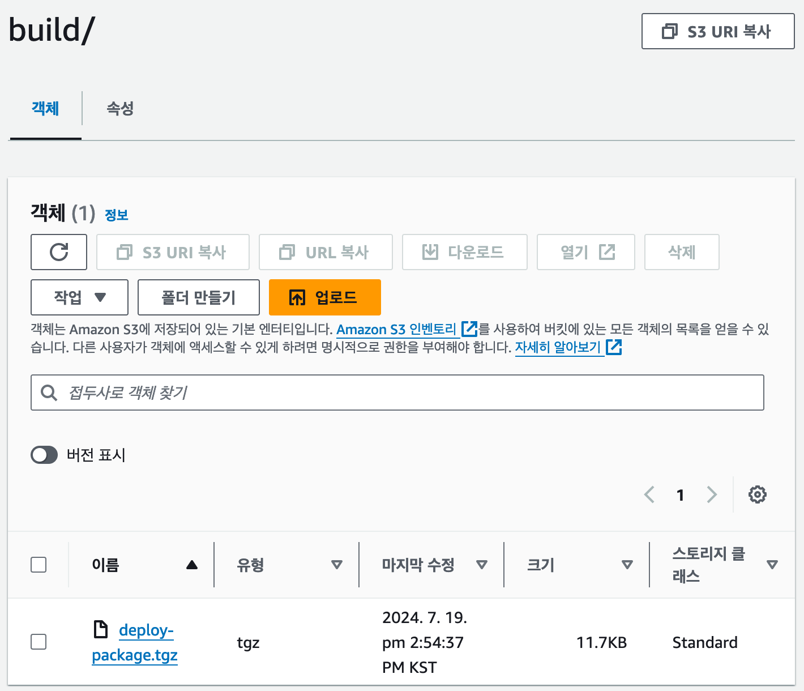
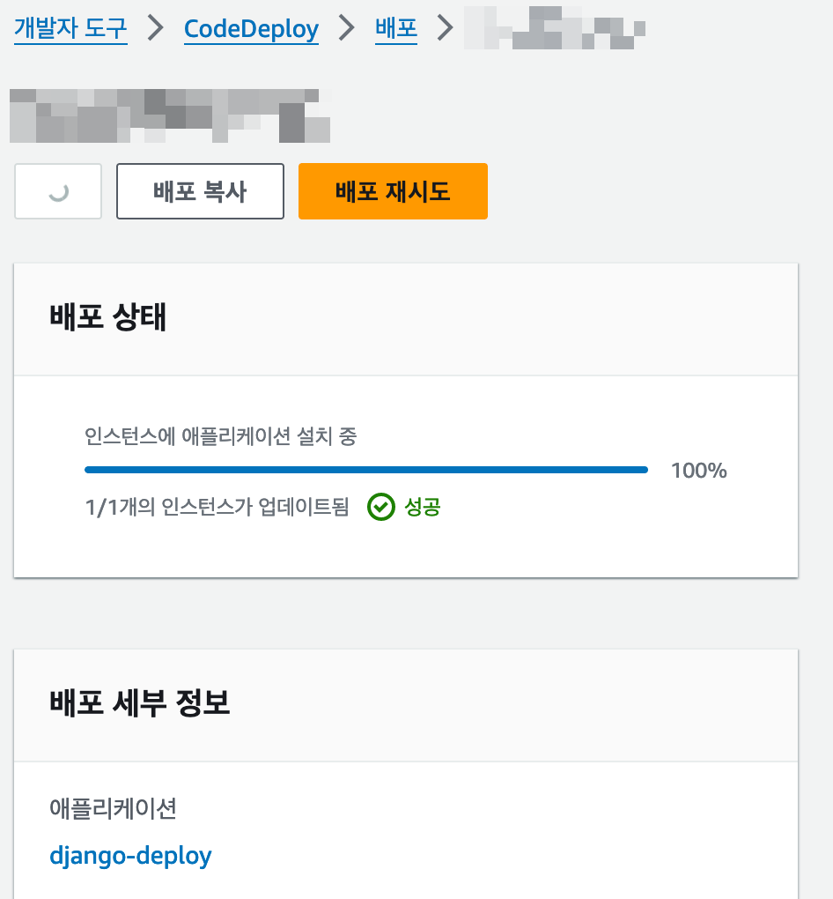

# 4. CI/CD 구축
### Backend 서버 CI/CD 구현

목적: Backend repo 코드를 활용한 배포 자동화

#### 1) Github Actions

workflow를 구축하여 특정 작업(push, PR) 시 Backend server(AWS EC2)에 코드가 자동으로 배포되도록 진행했습니다.

Actions에서는 다음 프로세스로 작업이 수행됩니다.

1.  main branch push or pull-request
2.  Make Tar File: repo의 코드를 압축 후 .tgz파일을 생성합니다.
3.  Configure AWS Credentials: AWS Credentials를 설정합니다. (Github secrets사용)
4.  Upload to S3: S3에 압축 파일을 업로드합니다.
5.  Code Deploy: AWS CodeDeploy에 미리 정의된 애플리케이션을 호출합니다.

#### 2) AWS CodeDeploy

AWS CodeDeploy의 애플리케이션을 생성했습니다.

중요한 것은 애플리케이션에 배포 그룹을 생성해줘야합니다. 배포 그룹을 통해서 CodeDeploy가 원하는 EC2 인스턴스에 배포가 가능하도록 구성합니다. 배포 그룹 생성 시 적용한 설정들을 소개합니다.

**서비스 역할**

: CodeDeploy가 인스턴스에 액세스하는 것을 허용하는 IAM 서비스 역할을 부여해야 합니다. 미리 생성해 둔 역할의 ARN으로 적용시켜 주었습니다. 역할에는 AWSCodeDeployFullAccess 정책이 부여되어 있습니다.

**환경 구성**

: 배포하고자 하는 EC2인스턴스를 설정합니다. 키-값으로 설정하였고, Backend서버 1대에 배포할 것이기 때문에 1개의 인스턴스만 연결해 두었습니다.

